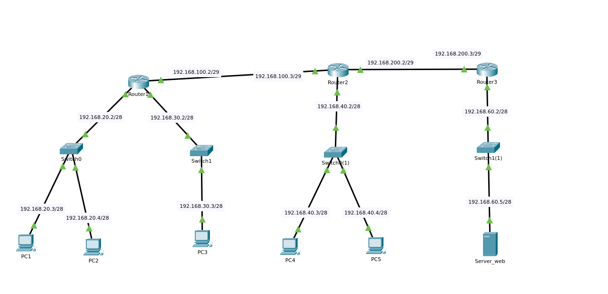

# 🌐 Docker Network Playground

[](https://www.docker.com/)
[](https://opensource.org/licenses/MIT)
[](https://www.linux.org/)
[](https://www.gnu.org/software/bash/)

> A complete Docker-based network simulation environment for learning, testing, and demonstrating networking concepts.

**Perfect for**: Students, Network Engineers, DevOps, Security Researchers, Educators



---

## ✨ Features

- 🏗️ **Multi-Router Topology** - 3 routers interconnecting 4 LANs and transit networks
- 🖥️ **10 Containers** - 5 PCs, 3 routers, 1 web server, 1 DNS server
- 🔒 **Firewall Scenarios** - Pre-configured iptables examples with auto-rollback
- 🌍 **NAT Configuration** - SNAT, DNAT, and port forwarding examples
- 📊 **Real-time Monitoring** - Web dashboard for network statistics
- 🧪 **Network Simulation** - Latency, packet loss, bandwidth limits
- 🔍 **Automated Testing** - Connectivity and DNS resolution tests
- 🛡️ **Security Safe** - Auto-rollback for risky operations
- 📚 **Educational Content** - Tutorials, exercises, and networking basics
- 🚀 **Easy to Use** - Interactive menu or CLI commands

---

## 🚀 Quick Start

### Prerequisites

- Docker Engine 20.10+
- Docker Compose 2.0+
- Linux host (Ubuntu/Debian recommended)

### Installation

```bash
# Clone the repository
git clone https://github.com/manzolo/net-playground.git
cd net-playground

# Build images
./menu.sh build

# Start the environment
./menu.sh start

# Check status
./menu.sh status

# Run tests
./menu.sh test-all

# Access dashboard
./menu.sh monitor
# Then open: http://localhost/dashboard/
```

**That's it!** You now have a complete network lab running.

---

## 🗺️ Network Topology


### Network Summary

| Host | IP Address(es) | Role | Network |
|------|---------------|------|---------|
| **pc1** | 192.168.20.3 | Client PC | LAN 20 |
| **pc2** | 192.168.20.4 | Client PC | LAN 20 |
| **pc3** | 192.168.30.3 | Client PC | LAN 30 |
| **pc4** | 192.168.40.3 | Client PC | LAN 40 |
| **pc5** | 192.168.40.4 | Client PC | LAN 40 |
| **router1** | 192.168.20.2, 192.168.30.2, 192.168.100.2 | Router | LAN 20, LAN 30, Transit 12 |
| **router2** | 192.168.40.2, 192.168.100.3, 192.168.200.2 | Router | LAN 40, Transit 12, Transit 23 |
| **router3** | 192.168.60.2, 192.168.200.3 | Router | LAN 60, Transit 23 |
| **server_web** | 192.168.60.5 | Nginx Web Server | LAN 60 |
| **dns** | 192.168.{20,30,40,60}.10 | DNS Server (multi-homed) | All LANs |

---

## 📖 Usage

### Interactive Menu

Run the interactive menu for guided operations:

```bash
./menu.sh
```

### CLI Commands

Use CLI commands for automation and scripting:

```bash
# Container management
./menu.sh start              # Start all containers
./menu.sh stop               # Stop all containers
./menu.sh restart            # Restart containers
./menu.sh clean              # Clean restart
./menu.sh status             # Show status
./menu.sh logs [container]   # View logs

# Testing
./menu.sh test-connectivity  # Test network connectivity
./menu.sh test-dns           # Test DNS resolution
./menu.sh test-all           # Run all tests
./menu.sh troubleshoot       # Run diagnostic wizard

# Monitoring
./menu.sh stats              # Show network statistics
./menu.sh monitor            # Generate monitoring data
./menu.sh dashboard          # View dashboard URL

# Scenarios
./menu.sh scenario <name>    # Run a scenario
./menu.sh list-scenarios     # List available scenarios

# Container access
./menu.sh enter pc1          # Enter a container
```

---

## 🎯 Use Cases

### 1. Learning Networking Basics

Perfect for students learning:
- IP addressing and subnetting
- Routing between networks
- DNS resolution
- Gateway configuration
- Network troubleshooting

**Example:**
```bash
# Enter pc1 and explore
./menu.sh enter pc1

# Inside pc1:
ip addr show              # View IP configuration
ip route show             # View routing table
ping 192.168.30.3        # Test connectivity to pc3 (different LAN)
traceroute 192.168.60.5  # Trace route to web server
nslookup server_web      # Test DNS resolution
```

### 2. Firewall Configuration

Learn and test iptables firewall rules safely with auto-rollback:

```bash
# Enter a router
./menu.sh enter router1

# Inside router1:
/scripts/container/firewall-examples.sh help
/scripts/container/firewall-examples.sh block-icmp 192.168.20.3
/scripts/container/firewall-examples.sh rate-limit 5/second
```

**Safety feature**: Rules automatically rollback after 60s unless confirmed!

### 3. Network Problems Simulation

Simulate real-world network issues for testing:

```bash
# Simulate high latency
docker exec pc1 /scripts/container/network-problems.sh latency eth0 100ms 20ms

# Simulate packet loss
docker exec router1 /scripts/container/network-problems.sh packet-loss eth1 10

# Simulate bandwidth limit
docker exec pc1 /scripts/container/network-problems.sh bandwidth eth0 1mbit

# Test application behavior under these conditions
docker exec pc1 curl -w "Time: %{time_total}s\n" http://server_web
```

### 4. Traffic Generation & Load Testing

Generate realistic network traffic:

```bash
# HTTP load testing
docker exec pc1 /scripts/container/generate-traffic.sh http server_web 100 0.5

# Mixed traffic simulation
docker exec pc1 /scripts/container/generate-traffic.sh mixed 60

# Bandwidth testing with iperf3
docker exec server_web iperf3 -s &
docker exec pc1 iperf3 -c 192.168.60.5 -t 10
```

### 5. Security Testing

Practice network security concepts:

```bash
# Run a pre-configured firewall scenario
./menu.sh scenario 01-basic-firewall.sh

# Configure NAT/PAT
docker exec router1 /scripts/container/nat-setup.sh help

# Port forwarding example
docker exec router2 /scripts/container/nat-setup.sh dnat 8080 192.168.60.5 80
```

### 6. Monitoring & Analytics

Real-time network monitoring:

```bash
# Generate monitoring data
./menu.sh monitor

# View in browser
firefox http://localhost/dashboard/

# Or watch stats in terminal
./scripts/host/network-stats.sh --loop
```

---

## 🧪 Pre-configured Scenarios

The playground includes ready-to-run scenarios:

### 01 - Basic Firewall Configuration
Learn iptables basics with guided examples:
- Block ICMP from specific hosts
- Rate limiting (anti-DDoS)
- Port filtering

```bash
./menu.sh scenario 01-basic-firewall.sh
```

### 04 - Traffic Generation
Generate various types of network traffic:
- HTTP requests
- Continuous ping
- DNS queries
- Mixed traffic
- Bandwidth testing

```bash
./menu.sh scenario 04-traffic-generation.sh
```

**More scenarios**: See [docs/SCENARIOS.md](docs/SCENARIOS.md)

---

## 🛠️ Advanced Features

### Network Problem Simulation

Simulate real-world network conditions:
- **Latency**: Add delay with optional jitter
- **Packet Loss**: Drop packets randomly
- **Bandwidth Limits**: Cap throughput
- **Packet Corruption**: Simulate data corruption
- **Unstable Networks**: High jitter + variable loss

### NAT Configuration

Configure Network Address Translation:
- **SNAT**: Source NAT (masquerading)
- **DNAT**: Destination NAT (port forwarding)
- **Full NAT Gateway**: Complete gateway setup

### Automated Diagnostics

The troubleshoot wizard checks:
- ✅ Docker installation
- ✅ Container health
- ✅ Network configuration
- ✅ Connectivity
- ✅ DNS resolution
- ✅ Service availability
- ✅ Routing tables

```bash
./menu.sh troubleshoot
```

### Monitoring Dashboard

Web-based dashboard showing:
- Container status and health
- CPU, Memory, Network I/O
- Network topology
- Auto-refresh (configurable)

---

## 📚 Documentation

- **[Scenarios Guide](docs/SCENARIOS.md)** - Detailed scenario descriptions
- **[Networking Basics](docs/NETWORKING-BASICS.md)** - Core networking concepts
- **[Troubleshooting Guide](docs/TROUBLESHOOTING.md)** - Common issues and solutions
- **[Exercises](docs/EXERCISES.md)** - Hands-on tutorials and challenges
- **[API Documentation](docs/API.md)** - Script interfaces and JSON formats

---

## 🎓 Educational Value

This project is ideal for:

- **Networking Courses**: Practical lab for theory
- **Certification Prep**: CCNA, CompTIA Network+
- **Self-Learning**: Hands-on networking practice
- **DevOps Training**: Container networking
- **Security Training**: Firewall and NAT configuration
- **Interview Prep**: Demonstrate networking knowledge

### Learning Path

1. **Start**: Complete the Quick Start guide
2. **Basics**: Read [Networking Basics](docs/NETWORKING-BASICS.md)
3. **Practice**: Work through [Exercises](docs/EXERCISES.md)
4. **Experiment**: Try the pre-configured scenarios
5. **Challenge**: Create your own network scenarios

---

## 🐛 Troubleshooting

### Containers not starting?

```bash
# Check Docker service
sudo systemctl status docker

# View logs
./menu.sh logs

# Clean restart
./menu.sh clean
```

### Connectivity issues?

```bash
# Run automated diagnostics
./menu.sh troubleshoot

# Check routing
docker exec router1 ip route

# Verify IP forwarding
docker exec router1 sysctl net.ipv4.ip_forward
```

### Dashboard not loading?

```bash
# Generate monitoring data
./menu.sh monitor

# Check if web server is running
docker ps | grep server_web

# Verify port 80 is exposed
curl http://localhost/dashboard/
```

**More help**: See [docs/TROUBLESHOOTING.md](docs/TROUBLESHOOTING.md)

---

## 🤝 Contributing

Contributions are welcome! Here's how:

1. Fork the repository
2. Create a feature branch (`git checkout -b feature/AmazingFeature`)
3. Commit your changes (`git commit -m 'Add some AmazingFeature'`)
4. Push to the branch (`git push origin feature/AmazingFeature`)
5. Open a Pull Request

### Ideas for Contributions

- Additional network scenarios
- More exercises and tutorials
- Dashboard enhancements
- Additional network tools
- Documentation improvements
- Bug fixes and optimizations

---

## 📋 Requirements

- **OS**: Linux (Ubuntu 20.04+ recommended)
- **Docker Engine**: 20.10 or higher
- **Docker Compose**: 2.0 or higher
- **RAM**: 4GB minimum, 8GB recommended
- **Disk Space**: 2GB for images

### Docker Installation

```bash
# Ubuntu/Debian
curl -fsSL https://get.docker.com -o get-docker.sh
sudo sh get-docker.sh
sudo usermod -aG docker $USER

# Start Docker
sudo systemctl start docker
sudo systemctl enable docker
```

---

## 🔒 Security Notes

This is an **educational tool** designed for learning in isolated environments:

- ⚠️ Do not expose container ports to public networks
- ⚠️ The environment is not hardened for production use
- ⚠️ Use in isolated lab environments only
- ✅ All firewall changes have auto-rollback safety
- ✅ No persistence of destructive configurations

---

## 📊 Architecture

### Container Images

- **PC Image**: Ubuntu 24.04 + network tools (ping, traceroute, tcpdump, curl, iperf3, dnsutils)
- **Router Image**: Ubuntu 24.04 + routing tools (iproute2, iptables, tc)
- **Web Server**: Nginx 1.27 + network tools
- **DNS Server**: Dnsmasq (multi-homed across all LANs)

### Network Design

- **4 LANs**: Separate /28 networks for different zones
- **2 Transit Networks**: /29 point-to-point links between routers
- **Bridge Driver**: Docker bridge networking with custom networks
- **DNS**: Multi-homed dnsmasq providing resolution across all networks

---

## 🎬 Demo

Watch the playground in action:

```bash
# Start environment
./menu.sh start

# Run all tests (should see 27/27 pass)
./menu.sh test-all

# Check live stats
./menu.sh stats

# Try a scenario
./menu.sh scenario 01-basic-firewall.sh
```

---

## ❓ FAQ

**Q: Can I modify the network topology?**
A: Yes! Edit `docker-compose.yml` to add networks or containers. Update routing accordingly.

**Q: Why doesn't cross-LAN ping work between all PCs?**
A: Docker's bridge driver isolates networks by design. This demonstrates network segmentation. Same-LAN connectivity and router transit work perfectly.

**Q: Can I use this for production?**
A: No, this is an educational tool. It's not hardened or optimized for production use.

**Q: How do I persist configurations?**
A: Container configurations are ephemeral by design. For persistence, modify the setup scripts or Dockerfiles.

**Q: Can I run this on macOS/Windows?**
A: Docker Desktop on macOS/Windows may work but Linux is recommended for full features.

**Q: How do I add more PCs?**
A: Add container definitions to `docker-compose.yml` following the existing PC pattern.

---

## 📄 License

This project is licensed under the MIT License - see the [LICENSE](LICENSE) file for details.

---

## 🌟 Acknowledgments

- Built with Docker and Docker Compose
- Uses dnsmasq for DNS services
- Inspired by real-world network labs
- Community contributions welcome!

---

## 📞 Support

- **Issues**: [GitHub Issues](https://github.com/manzolo/net-playground/issues)
- **Discussions**: [GitHub Discussions](https://github.com/manzolo/net-playground/discussions)
- **Documentation**: [docs/](docs/)

---

<div align="center">

**Made with ❤️ for the networking community**

[⬆ Back to Top](#-docker-network-playground)

</div>
